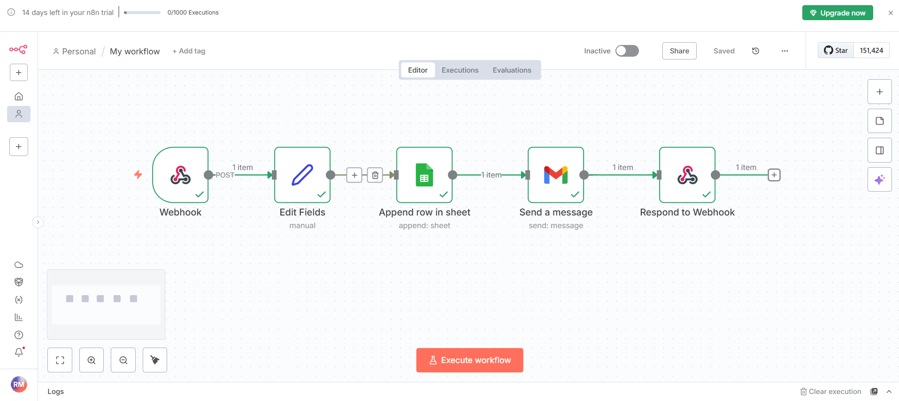
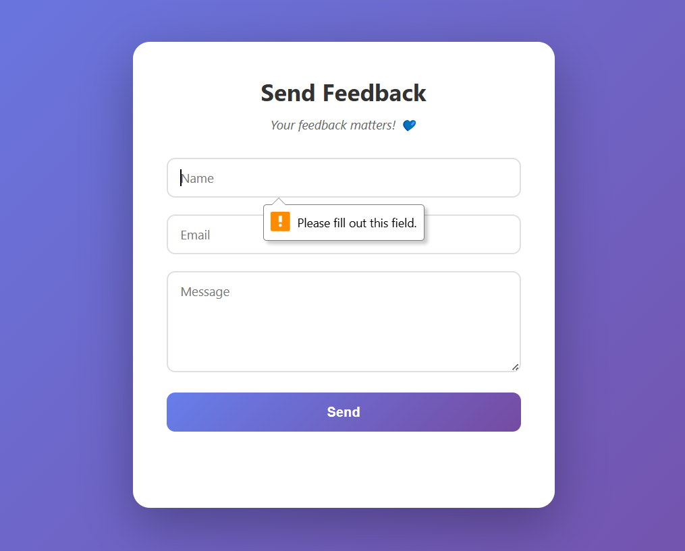

# 📝 Project Description

This project is a simple web-based contact form built using HTML, CSS, and JavaScript, integrated with an n8n workflow for backend automation.

## 🎥 Video Demo

[Watch Video Demo](./Demo.mp4)

## 📸 Screenshots

### Website Interface

### n8n Workflow

## How It Works

When a user submits the form:

1. The data (name, email, message) is sent via a webhook to n8n.
2. n8n automatically:
   * Saves the submission to a connected Google Sheet.
   * Sends a confirmation email to the user using Gmail integration.
   * Responds to the web app with a success message.

## ⚙️ Tech Stack

* **Frontend:** HTML, CSS, JavaScript
* **Backend Automation:** n8n workflow
* **Integrations:** Google Sheets, Gmail

## 🚀 Features

* Responsive contact form
* Automated data logging in Google Sheets
* Automatic email reply to the user
* CORS-enabled webhook for smooth frontend-backend communication
